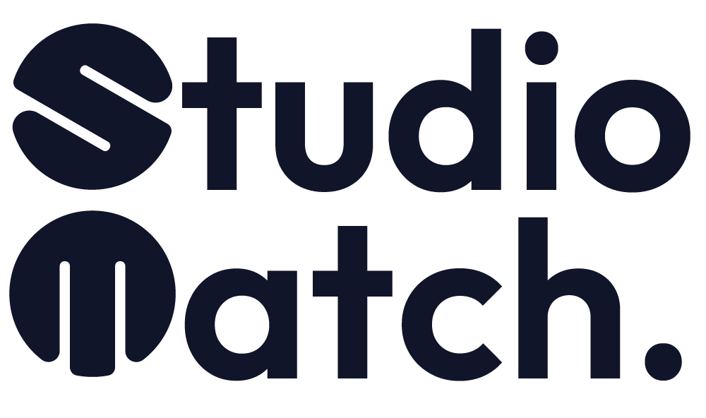

<p align="center">
  <picture>
    <source media="(prefers-color-scheme: dark)" srcset="public/logos/sm-primary-logo-wit.png">
    
  </picture>
</p>

<h3 align="center"><em>Every sound deserves a studio</em></h3>

<p align="center">
  Het platform waar artiesten en muziekstudio's elkaar vinden.<br>
  Zoeken &rarr; boeken &rarr; betalen &rarr; uitbetalen, in &eacute;&eacute;n vloeiende flow.
</p>

<p align="center">
  
  
  
  
  
  
</p>

---

## Over StudioMatch

StudioMatch is een Nederlandse marktplaats voor opname- en mix/master-studio's. Veel studio's zijn nu alleen vindbaar via Instagram en mond-tot-mond; StudioMatch haalt ze uit de anonimiteit en verbindt ze met artiesten die actief naar studiotijd zoeken.

**Voor artiesten:** zoeken op locatie, prijs, datum, apparatuur en meer; direct online boeken en veilig betalen via iDEAL of creditcard.

**Voor studio-eigenaren:** één agenda, automatische facturatie en snelle uitbetaling via Stripe Connect, tegen 9% commissie per boeking. Geen abonnement, geen exclusiviteit.

### Kernprincipes (uit de scope)

1. Eén vloeiende boekingsflow gaat vóór veel functies
2. Edge cases via de admin, niet via code
3. Stripe Connect is de financiële ruggengraat
4. Mobiel is niet "ook", mobiel is leidend
5. Alles wat niet nodig is voor `zoeken → boeken → betalen → uitbetalen` is fase 2

## MVP-scope in het kort

| In de MVP | Bewust niet (fase 2 / buiten scope) |
|---|---|
| Publieke site met SEO-basis (NL + EN) | Blog/CMS *(BESLISSING 13: naar fase 2)* |
| Studio- en ruimteprofielen met goedkeuringsflow | Agenda-sync (iCal/Google) *(grootste risico, zie scope)* |
| Zoeken en filteren + kaartweergave | Chat tussen artiest en studio |
| Beschikbaarheid, blokkades en vakantiemodus | Reviews *(placeholder-UI aanwezig, formeel beslispunt)* |
| Boeken en betalen via Stripe (iDEAL + creditcard) | Kortingscodes, toeslagen, dagdeeltarieven |
| Facturatie en btw via Moneybird | Borg, verzekering en no-showboetes |
| Uitbetaling via Stripe Connect Express (9%) | Native app, meerdere landen/valuta |
| Dashboards: artiest, verhuurder en admin | Automatische dispute-/chargebackworkflows |
| "Meld een probleem"-flow met payout-hold | Eigen KYC/IBAN-validatie *(doet Stripe)* |

De volledige functionele afbakening, beslispunten (1 t/m 17) en risico's staan in [`studiomatch-scope.md`](studiomatch-scope.md).

## Status frontend

| Pagina | Route | Status |
|---|---|---|
| Home (hero + zoekbalk + studio-sliders) | `/` | ✅ |
| Studio's zoeken (filters conform scope §2.3) | `/studios` | ✅ |
| Studio-detail (profiel + boekwidget met prijsopbouw) | `/studios/{studio}` | ✅ |
| Voor studio's (wervingspagina) | `/voor-studios` | ✅ |
| Hoe werkt StudioMatch | `/hoe-werkt-het` | ✅ |
| FAQ | `/faq` | ✅ |
| Contact | `/contact` | ✅ |
| Taalwissel NL/EN | `/language/{locale}` | ✅ |

Alle pagina's zijn responsive (mobiel-first, incl. fullscreen menu en mobiele zoek-modal), tweetalig, voorzien van SEO-meta + schema.org en scroll-animaties. Data is nog **placeholder**; het datamodel, auth en de boekflow volgen.

### Volgende stappen

- [ ] Datamodel: studio's, ruimtes, beschikbaarheid, boekingen
- [ ] Auth + rollen (artiest / verhuurder / admin, BESLISSING 10)
- [ ] Boekflow met slot-reservering (15 min) en statusmachine
- [ ] Stripe Connect: checkout, webhooks, payout-hold
- [ ] Facturatie via Moneybird
- [ ] Dashboards en admin-paneel
- [ ] Mailmatrix (transactionele mail met SPF/DKIM/DMARC)
- [ ] Juridische pagina's *(teksten worden aangeleverd)*

## Huisstijl

| Kleur | Hex | Gebruik |
|---|---|---|
|  | `#AD0924` | Ruby Red - accenten, CTA's |
|  | `#101529` | Prussian Blue - primaire kleur, donkere vlakken |
|  | `#383E46` | Charcoal Blue - secundair |
|  | `#FFFFFF` | White |

- **Font:** [Inter](https://rsms.me/inter/) (400/500/600/700), geladen via Bunny Fonts (AVG-vriendelijk)
- **Logo's:** [`public/logos/`](public/logos/) (primair/secundair/sub-mark, in blauw en wit)
- **Tailwind-tokens:** gedefinieerd in [`resources/css/app.css`](resources/css/app.css) (`bg-ruby-red`, `text-prussian-blue`, enz.)

## Techniek

| Laag | Keuze |
|---|---|
| Backend | Laravel 13, PHP 8.4 |
| Frontend | Blade-components + Tailwind CSS 4 + Vite 8 |
| Database | MySQL (`studiomatch`) |
| Betalingen | Stripe Connect Express *(gepland)* |
| Facturatie | Moneybird *(gepland)* |
| i18n | Laravel-localisatie, NL (standaard) + EN |
| Iconen | Font Awesome (lokaal, `public/fontawesome/`) |

## Aan de slag

**Vereisten:** PHP 8.4+, Composer, Node.js, MySQL (bijv. via [Laragon](https://laragon.org)).

```bash
# 1. Alles in één keer: composer install, .env, app-key, migraties, npm install + build
composer run setup

# 2. Maak de database aan (naam: studiomatch) en check de DB-gegevens in .env

# 3. Ontwikkelen: server + queue + logs + Vite in één commando
composer run dev
```

Draai je via Laragon, dan is de site bereikbaar op `http://studiomatch.test`. Los ontwikkelen kan ook met `php artisan serve` + `npm run dev`.

> **Let op:** laat tijdens het stylen altijd `npm run dev` draaien; Tailwind 4 genereert alleen classes die het in de templates tegenkomt. Zie je geen styling en draait er geen dev-server, verwijder dan een achtergebleven `public/hot`-bestand of draai `npm run build`.

## Projectstructuur (hoogtepunten)

```
resources/
├── css/app.css              # Tailwind-thema: kleuren, fonts, animaties
├── js/app.js                # Dropdowns, sliders, header, modals, scroll-reveal
└── views/
    ├── components/          # layout, header, footer, hero, studio-card,
    │                        # studio-slider, filter-group, phone-mockup, ...
    └── *.blade.php          # pagina's (welcome, studios, hosts, how, faq, ...)
lang/
├── nl/                      # Nederlands (standaard)
└── en/                      # Engels
config/localization.php      # ondersteunde talen
studiomatch-scope.md         # functionele scope, beslispunten en risico's
```

---

<p align="center">
  <sub>© StudioMatch VOF · KvK 94893527 · Software gemaakt in samenwerking met <a href="https://eazyonline.nl"><strong>Eazyonline</strong></a></sub>
</p>
